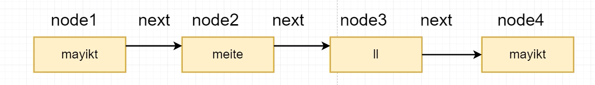

# List接口下的子类
## ArrayList:   
    线程不安全,每次扩容是原来容量的1.5倍;
## Vector:  
    线程安全,每次扩容的容量是原来的2倍,也可以自己设置扩容;
## 
    相同点: 默认容量都是10,List接口下的子类;

## 数组数据结构
    1.根据index下标查询效率非常高,
    2.增加删除效率很低;
## 链表数据结构
    1.链表数据结构增加,删除效率很高;
    2.查询效率很低;
    4.增加时不需要扩容;
### 单向链表

### 双向链表

## ArrayList:
    底层基于数组实现
    add方法:
        1.判断集合容量是否装得下
        2.如歌装不下则扩容,1.5倍,在将原来的数组拷贝到新的数组中;
    get方法:
        1.直接提供了index下标查询,效率非常高
    remove方法:
        1.查找到删除对应的index下标对应的后面的元素向前移动;
## LinkedList:
    底层基于双链表实现;
**基本特性:**
* 双向链表
* 非线程安全
* 元素允许为null,允许重复元素
* 增加删除效率高,查找效率低
* 不存在扩容方法
* 实现栈和队列操作方法,因此也可以作为栈,队列和双端队列来使用